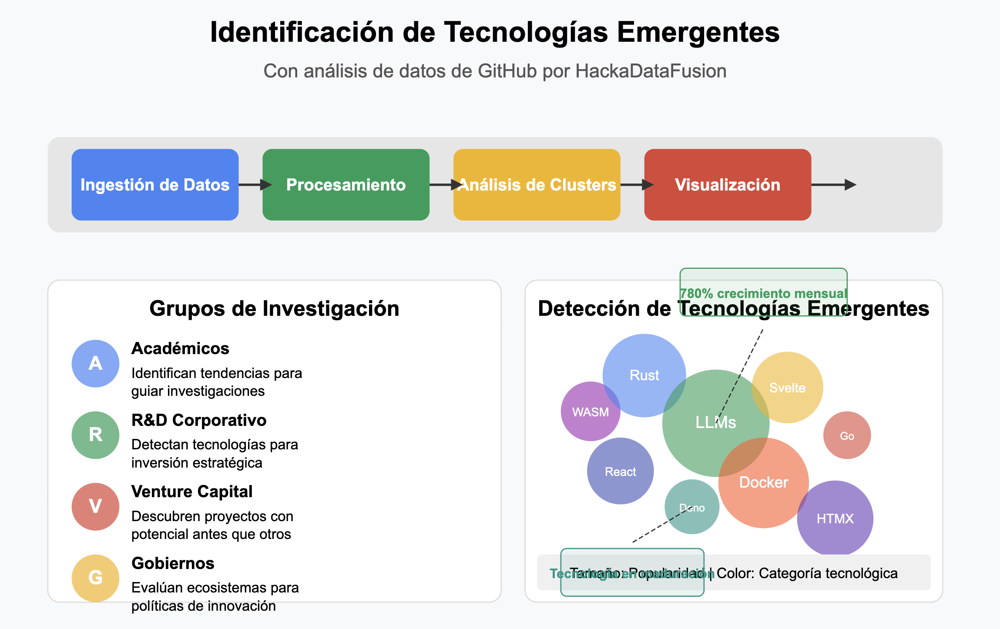
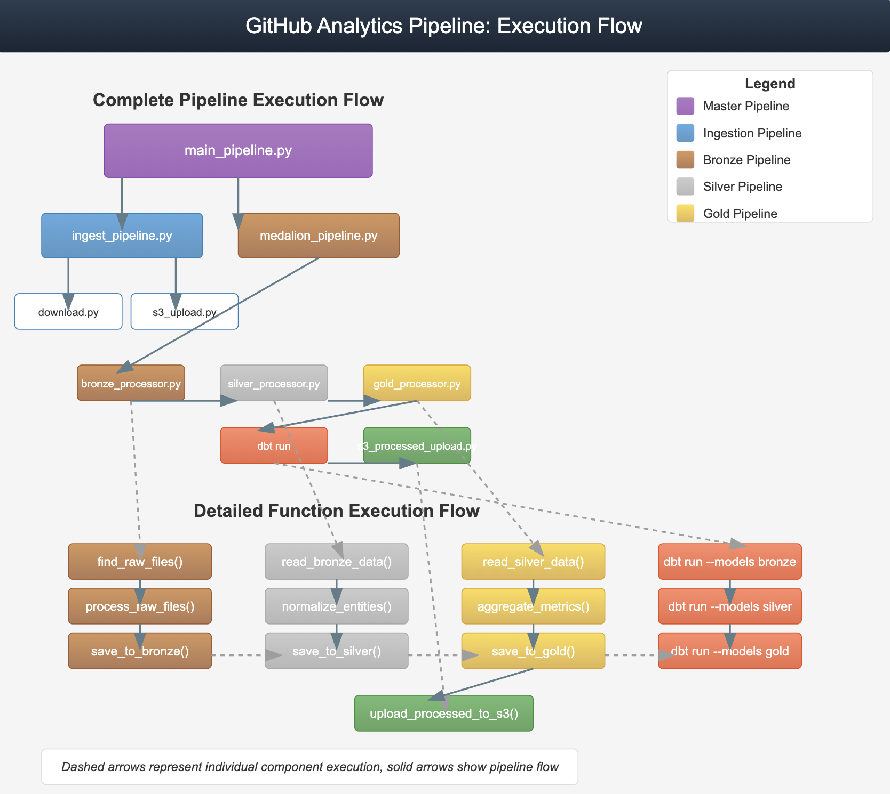

# GitHub Event Intelligence Pipeline


## 👥 Team
We are a team made of data science engineering students at UPB
- Roy Sandoval - Data Science Engineering Student
- Andrés Arias - Data Science & Computer Science Engineering Student (Leader)
- Pablo Peralta - Data Science Engineering Student
- Felipe Buitrago - Data Engineer @ Globant

## 📋 Overview
The GitHub Event Intelligence Pipeline is a comprehensive data engineering and analytics solution for processing and analyzing GitHub Archive data. This project was developed for the GDC Fusion | Wizeline Hackathon 2025, aiming to extract valuable insights from GitHub event data using modern data engineering practices and analytics techniques.

## 🎯 Project Purpose
The primary purpose of this project was to create a data platform that is:

### Scalable
- Horizontally scalable data processing.
- Cloud-native architecture leveraging managed services.
- Resource-efficient processing for large data volumes.
- Separation of storage and compute for independent scaling.

### Maintainable
- Clear separation of concerns with modular components.
- Comprehensive logging and error handling.
- Well-documented code and pipeline architecture.
- Testing at multiple levels (unit, integration, data quality).

### Reproducible
- Infrastructure-as-code approach.
- Deterministic data transformations.
- Version-controlled artifacts and models.
- Environment parity across development and production.

This foundation enables data teams to efficiently extract valuable insights from GitHub event data while maintaining the ability to evolve and extend the platform as requirements change.

Our integration of MLflow enhances the GitHub Analytics Pipeline by providing robust experiment tracking, model versioning, and deployment capabilities. MLflow captures model parameters, metrics, and artifacts during the clustering analysis phase, enabling reproducible experiments and simplified model management. This seamless integration allows data scientists to compare different clustering approaches, track performance metrics over time, and deploy optimized models directly to production, all within our scalable data architecture.

## Problem


## 🏗️ Architecture
This project implements a modern data pipeline with the Medallion Architecture:
- **Bronze Layer**: Raw data ingestion from GitHub Archive
- **Silver Layer**: Cleaned and normalized data
- **Gold Layer**: Business-level aggregations and metrics


## 📦 Repository Structure
```
.
├── data/                  # Data storage
│   ├── external/          # External data sources
│   ├── raw/               # GitHub archive raw data 
│   └── processed/         # Processed data files
├── docs/                  # Documentation
├── notebooks/             # Jupyter notebooks for EDA
├── src/                   # Source code
│   ├── config/            # Configuration files
│   ├── data_flow/         # Data processing modules
│   │   ├── data_preprocessing/ # Medallion architecture processors
│   │   ├── download/      # Data download utilities
│   │   ├── models/        # Models creation 
│   │   └── storage/       # Storage connection utilities
│   ├── dbt/               # DBT models and transformations
│   ├── pipeline/          # Pipeline orchestration
│   │   ├── ingest_pipeline.py # Pipeline ingestion 
│   │   ├── medalion_pipeline.py # Pipeline preprocessing
│   │   ├── model_pipeline.py      # Pipeline modeling
│   │   └── main_pipeline.py       # Master pipeline  
│   ├── scripts/           # Utility scripts
│   └── utils/             # Common utilities
└── tests/                 # Test suites
```

## 📑 Documentation Resources
The docs/ directory contains essential supplementary information that provides deeper insights into the project architecture, data structures, and implementation details:
Architectural Diagrams

- Pipeline Flow Charts: Visualizations of data flow through each processing stage
- Component Interaction Diagrams: Detailed illustrations of how system components communicate
- Infrastructure Architecture: Cloud resource deployments and network configurations
- Medallion Layer Transitions: Visual representation of data transformations between layers

## 🔧 Technical Details
### Medallion Architecture Implementation
Our implementation follows the Medallion Architecture pattern, which provides a clear separation of concerns and data quality levels:

#### Bronze Layer:
- Captures raw data in its original format from GitHub Archive.
- Performs minimal transformations (parsing JSON, basic validation).
- Preserves original data fidelity for auditing and reprocessing.
- Provides a foundation for the subsequent layers.

#### Silver Layer:
- Normalizes and cleans the data.
- Implements schema enforcement and data type standardization.
- Resolves entities and relationships (actors, repositories, organizations).
- Creates a reliable foundation for analytics.

#### Gold Layer:
- Builds business-level aggregations and metrics.
- Optimizes data for specific analytical use cases.
- Incorporates both Python-based aggregations and SQL/DBT transformations.
- Provides ready-to-use datasets for visualization and machine learning.

---

### Resource Management for Large Volumes
The ingestion pipeline includes sophisticated resource management techniques to handle GitHub Archive's large data volumes:

#### Selective Processing:
- Timestamp-based filtering to only process new data.
- Configurable limits on file processing to manage memory consumption.
- Checkpointing mechanism to resume processing after interruptions.

#### Efficient Memory Usage:
- Stream processing to avoid loading entire files into memory.
- Chunked processing with configurable chunk sizes.
- Garbage collection optimization during processing.

#### Processing Logs:
- Detailed logging of processed files with timestamps.
- Log-based resume functionality to avoid reprocessing data.
- Performance metrics tracking for optimization.

#### Parallelization:
- Configurable parallel processing of files.
- Thread pool management to balance resource usage.
- Dynamic resource allocation based on system capabilities.

---
### Integration with Cloud Services

The pipeline seamlessly integrates with cloud services:

#### AWS S3:
- Secure storage of raw and processed data.
- Versioning support for data lineage.
- Efficient transfer protocols with retry mechanisms.
- Cost-efficient storage classes for different data layers.

#### Snowflake:
- Optimized loading strategies using Snowflake's `COPY INTO` command.
- Warehouse auto-scaling configuration.
- Time-travel capabilities for data recovery.
- Integration with DBT for transformation orchestration.

---

### DBT Implementation

Our DBT models follow these principles:

#### Model Organization:
- Clear separation of layers (bronze, silver, gold).
- Consistent naming conventions for easy navigation.
- Modular design with appropriate dependencies.

#### Testing Framework:
- Schema tests for data integrity.
- Custom data quality tests.
- Assertions for business logic validation.

#### Documentation:
- Auto-generated documentation from model descriptions.
- Data lineage visualization.
- Business context for each model.

## 🚀 Getting Started

### Prerequisites

- Python 3.9+
- Poetry for dependency management
- AWS Account (for S3 storage)
- Snowflake Account
- dbt Core

### Installation

1. Clone the repository:
```bash
git clone https://github.com/yourusername/HackaDataFusion-2.git
cd HackaDataFusion-2
```

2. Install dependencies using Poetry:
```bash
poetry install
```

3. Before running the pipeline, you need to create a .env file in the project root with the following structure:
```bash
# AWS Configuration
AWS_ACCESS_KEY_ID=your_access_key
AWS_SECRET_ACCESS_KEY=your_secret_key
AWS_DEFAULT_REGION=your_region
S3_BUCKET_NAME=your_bucket_name

# Snowflake Configuration
SNOWFLAKE_ACCOUNT=your_account_id
SNOWFLAKE_USER=your_username
SNOWFLAKE_PASSWORD=your_password
SNOWFLAKE_WAREHOUSE=COMPUTE_WH
SNOWFLAKE_DATABASE=GITHUB_DATA
SNOWFLAKE_SCHEMA=BRONZE
SNOWFLAKE_ROLE=ACCOUNTADMIN

# GitHub API (optional, for enhanced metadata)
GITHUB_TOKEN=your_github_token

# Pipeline Configuration
MAX_FILES_PER_RUN=10
CHUNK_SIZE=10000
PARALLEL_PROCESSES=4
LOG_LEVEL=INFO
```

### Running the Pipeline

```bash
poetry run python src/pipeline/main_pipeline.py
```
## Running Individual Components
You can also run individual components of the pipeline:

```bash
poetry run python src/pipeline/ingest_pipeline.py
```

```bash
poetry run python src/pipeline/medalion_pipeline.py
```

```bash
poetry run python src/pipeline/model_pipeline.py
```


## 📊 Dashboards and Analysis

After running the pipeline, analytics dashboards can be accessed through your chosen visualization tool:
- Metabase
- Looker Studio
- Apache Superset

Key insights include:
- Trending GitHub repositories
- Activity patterns by language and region
- Anomaly detection for unusual event patterns
- User contribution analysis
## 🛡️ Security Practices

We implemented several security practices in this project:

### Environment Variables
- All sensitive information is stored in environment variables.
- No hardcoded credentials in the codebase.
- Support for different credential sources (environment, config files, AWS Secrets Manager).

### Least Privilege Principle
- Custom IAM roles with minimal permissions.
- Temporary credentials when possible.
- Scoped Snowflake access roles.

### Data Protection
- Encryption in transit and at rest.
- Data masking for sensitive fields.
- Access logging for audit trails.

### Areas for Improvement
During the hackathon, due to time constraints, we made some compromises:
- Some credential management was simplified.
- Not all connections use encrypted channels.
- Manual secret rotation instead of automated.
- Limited audit logging.

These areas would be addressed in a production environment with proper time allocation.

---

## 🔮 Future Extensibility

The architecture is designed to be extensible in several directions:

### Machine Learning Integration
- Feature store integration for ML model training.
- Model training orchestration.
- Inference pipelines for real-time insights.
- A/B testing infrastructure for model evaluation.

### Monitoring and Observability
- Data quality monitoring with Great Expectations.
- Pipeline health metrics with Prometheus.
- Alerting system with PagerDuty or similar services.
- Performance dashboards with Grafana.

### AI-Assisted Insights
- Anomaly detection for repository activity.
- Predictive models for trend forecasting.
- Natural language insights generation.
- Recommendation systems for developer collaboration.

### Real-time Extensions
While currently focused on batch processing, the system can be extended for real-time analytics:
- Event streaming architecture with Kafka or Kinesis.
- Real-time processing with Spark Streaming.
- Low-latency serving layer for dashboards.
- Change data capture for incremental updates.

## 🔄 Additional Future Extensibility - Engineering Best Practices

### Automated Testing

- **Unit Testing Framework**: Implement comprehensive `pytest` coverage for core functionalities with fixtures that simulate the GitHub data format.
- **Integration Tests**: End-to-end pipeline validation using smaller sample datasets.
- **Data Validation Tests**: Automated schema validation and data quality checks at each layer's boundaries.
- **Regression Test Suite**: Ensure new changes don't break existing functionality.
- **Performance Benchmarking**: Track pipeline execution metrics over time to identify degradation.

### CI/CD Integration
- **Pre-commit Hooks**: Implement hooks for code formatting (`black`, `isort`), static analysis (`flake8`, `mypy`), and security scanning (`bandit`).
- **GitHub Actions Workflow**: Automated testing on each PR with required passing checks.
- **Automated Deployments**: Infrastructure-as-code deployment with Terraform or AWS CDK.
- **Versioned Releases**: Semantic versioning for reliable rollbacks.
- **Environment Promotion**: Staged deployments from development to production.

### Data Quality Framework
- **Great Expectations Integration**: Define data quality expectations for each layer.
- **Data Contract Testing**: Validate that each component adheres to its data contracts.
- **Metadata Management**: Automated lineage tracking and data cataloging.
- **Data Drift Detection**: Monitoring for schema or statistical drift in the pipeline.
- **Reconciliation Testing**: Validate data consistency across transformations.

### Developer Experience
- **Local Development Environment**: Docker Compose setup mirroring production architecture.
- **Development Docs**: Comprehensive "Getting Started" guide with quickstart scripts.
- **API Documentation**: Auto-generated API docs with Sphinx.
- **Contribution Guidelines**: Clear steps for contributing new features or fixes.
- **Issue Templates**: Structured templates for bug reports and feature requests.

---
## 📄 License

This project is licensed under the MIT License - see the LICENSE file for details.

## 🙏 Acknowledgements

- [GHArchive](https://www.gharchive.org/) for providing the GitHub events data
- Wizeline for sponsoring the Hackathon
- The open-source community for all the amazing tools that made this project possible
